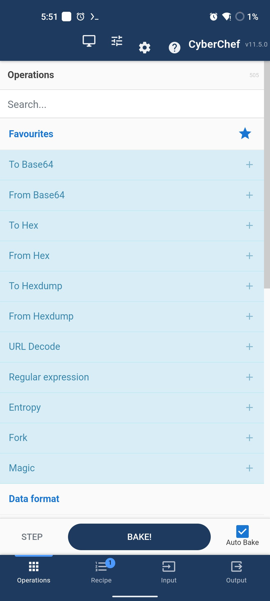
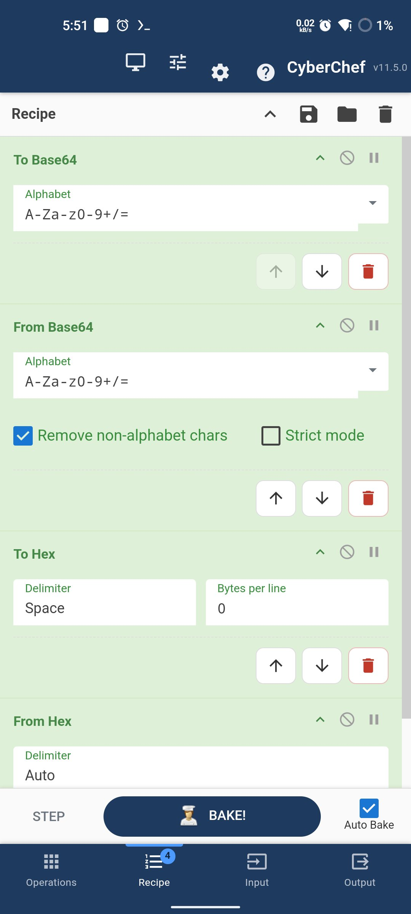
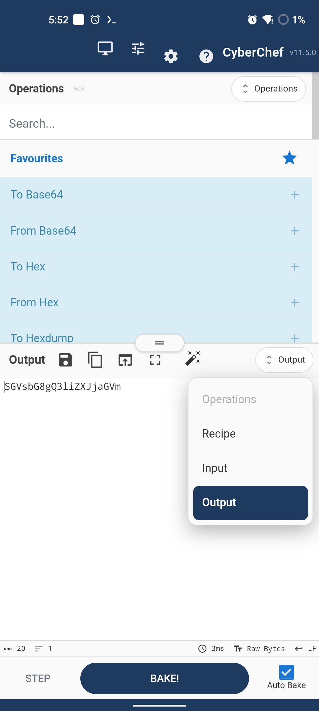
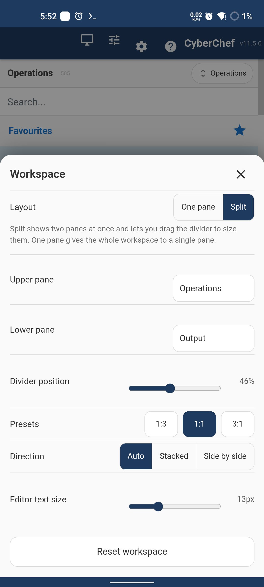
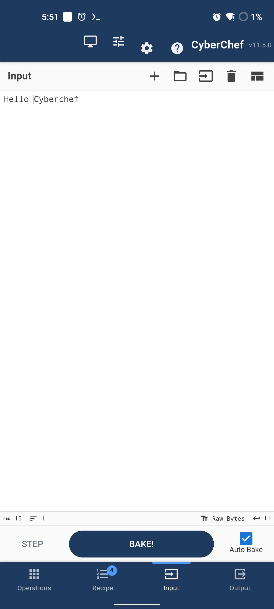
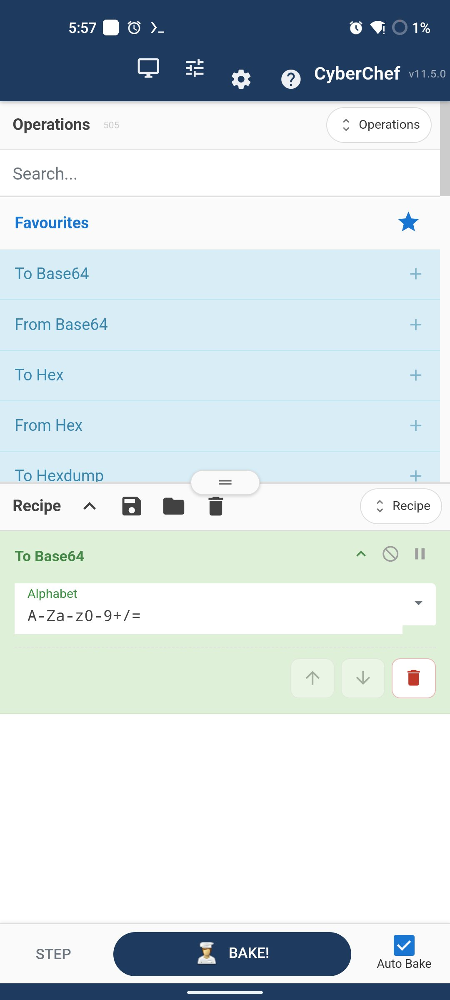
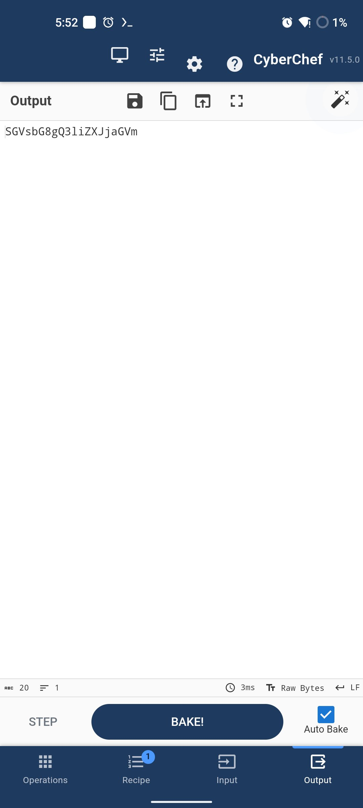
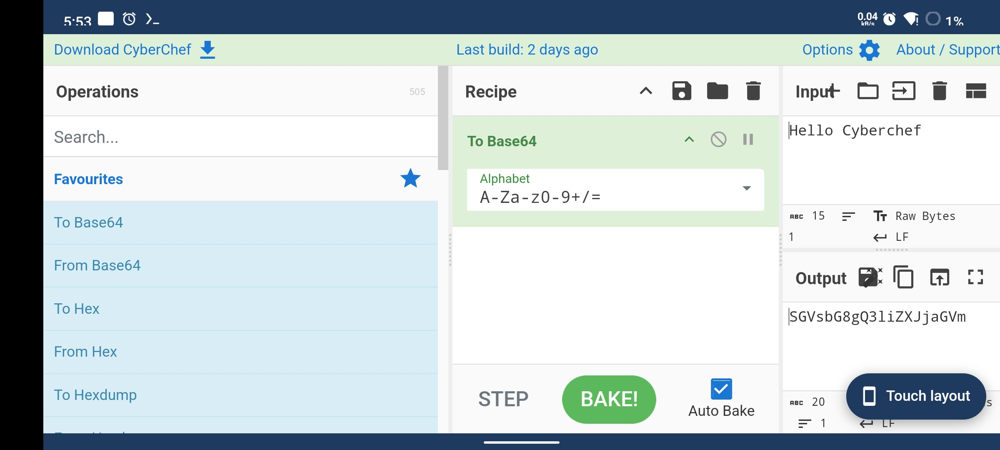

# CyberChef for Android

> **Unofficial port.** This is an independent Android build of CyberChef. It is
> not produced, endorsed, sponsored or approved by GCHQ, the Crown, or the
> CyberChef maintainers, and the Apache License grants no rights to the
> "CyberChef" name or logo (section 6). Please report bugs in *this* Android app
> here rather than in the upstream tracker.

A touch-first Android build of [CyberChef](https://github.com/gchq/CyberChef),
the Cyber Swiss Army Knife. All 500+ operations — including the lazily-loaded
ones and the OCR engine — run locally in the app's WebView, offline.

**Download:** [latest release](https://github.com/wh0ami-l/cyberchef-android/releases/latest)
· `minSdk 26` (Android 8.0) · `targetSdk 35` · ~26 MB

<p align="center">
  
  
  
  
</p>

## What makes it a mobile app rather than a wrapped web page

| | |
| --- | --- |
| **One pane at a time** | A bottom tab bar switches between Operations, Recipe, Input and Output, each full-bleed, instead of squeezing four desktop columns onto a phone. |
| **Resizable split** | Or show two panes at once and **drag the divider** to size them. Stacked in portrait, side by side in landscape. The ratio, the pane assignment and the direction all persist. |
| **Tap to add** | One tap on an operation adds it. Upstream binds double-click, which is awkward and error-prone with a finger. |
| **Explicit recipe controls** | Every step gets move-up / move-down / delete buttons, because drag-to-reorder is unreliable on a touch screen. |
| **A Back button that makes sense** | Back closes a dialog, then a menu, then clears a search, then returns to the previous tab — and only then leaves the app. |
| **Native file handling** | Saving streams the output to `Downloads/CyberChef/` in chunks, so large files never sit in memory. Files can also be shared *into* the app from any other app. |
| **Keyboard-aware** | The workspace shrinks above the soft keyboard rather than hiding behind it. |

### The basic flow

Type or load input, tap operations to add them, read the result — no dragging,
no double-taps:

<p align="center">
  
  
  
</p>

<p align="center">
  
</p>

## How this differs from other ways of running CyberChef on a phone

Upstream has no mobile UI, and the request has been open for years:

| Issue | Title | Opened | State |
| --- | --- | --- | --- |
| [gchq/CyberChef#181](https://github.com/gchq/CyberChef/issues/181) | Misc: Mobile UI | 2017-08-18 | open |
| [gchq/CyberChef#1416](https://github.com/gchq/CyberChef/issues/1416) | does not work properly on mobile phones | 2022-09-12 | open |
| [gchq/CyberChef#2051](https://github.com/gchq/CyberChef/issues/2051) | Feature request: Mobile Phone Support | 2025-05-24 | open |

#181 already framed the choice: *"1. Create an entirely separate UI for mobile
devices, 2. Make modifications to the current UI so that it adjusts better to fit
smaller screens."* This project takes route 1.

Existing packaging efforts take neither. The most complete one,
[`liudonghua123/cyberchef-app`](https://github.com/liudonghua123/cyberchef-app),
is a Tauri wrapper that ships an Android APK but contains **no mobile, touch or
responsive code** — CyberChef is a git submodule and the stock desktop four-pane
UI is what you get. Its own README says it works "quite well, actually - on
macOS, Windows, and Linux", conspicuously omitting the platform it ships an APK
for.

This project instead leaves the upstream sources **completely unmodified** and
injects a separate adaptation layer at packaging time, so CyberChef can be pulled
forward to a new release and repackaged at any time.

## Install

1. Download `CyberChef-app-release-v<version>.apk` from
   [Releases](https://github.com/wh0ami-l/cyberchef-android/releases).
2. Optionally verify it against the attached `.sha256` file.
3. Open it on the phone and allow installation from this source.

Nothing is sent anywhere. Three operations reach the network by design —
`HTTP request`, `DNS over HTTPS` and `Show on map` — and everything else runs
locally. CyberChef does its best work on airgapped machines, and so does this.

## Building

From a fresh clone:

```bash
scripts/bootstrap.sh        # toolchain + upstream checkout + web bundle + keystore
scripts/build-apk.sh        # package the web layer + Gradle release
```

`scripts/bootstrap.sh` is idempotent and does the whole setup: it downloads a
pinned JDK 17, Gradle and the Android SDK into `toolchain/` and `sdk/`, clones
CyberChef at the revision pinned in `CYBERCHEF_VERSION`, runs the web build, and
creates the release keystore if there is none. Nothing is installed system-wide
and no `sudo` is needed.

Host prerequisites: `git`, `node` (>=24 <27), `npm`, `curl`, `unzip`.

Useful flags:

```bash
scripts/build-apk.sh --skip-web    # Java/resources only (fast iteration)
scripts/build-apk.sh --debug       # assembleDebug instead
```

## Testing

`scripts/test-web.mjs` serves the packaged assets over a loopback origin — the
same kind of real origin the APK gets from `WebViewAssetLoader` — and drives
headless Chrome over the DevTools protocol at a phone viewport with touch
emulation. **69 checks**, covering the touch layout, the resizable split, the
workspace sheet, tap-to-add, reordering, deletion, clipboard, the reversible
desktop layout, and a real end-to-end bake through the Web Worker that loads a
lazily-imported module.

```bash
node scripts/package-web.mjs     # refresh android/app/src/main/assets/www
node scripts/test-web.mjs
node scripts/screenshot.mjs      # PNGs of every UI state in .build-tmp/shots/
```

Headless Chrome is not enough, though. `scripts/test-device.mjs` runs **29
checks against a real phone**, where every interaction is an actual
`adb shell input tap` / `swipe`:

```bash
scripts/build-apk.sh --debug
adb install -r android/app/build/outputs/apk/debug/app-debug.apk
node scripts/test-device.mjs
```

Two bugs shipped past the headless suite until it existed, and both are the kind
a wrapped desktop UI would have too:

- **Tapping an operation did nothing.** The operation list is sortable, and
  SortableJS cancels the synthetic click a tap produces, so the `click` listener
  never ran. Headless missed it because dispatching a synthetic
  `MouseEvent("click")` from JavaScript bypasses touch handling entirely.
- **Move-up silently undid itself.** On a touch device the browser's click
  arrives *before* `pointerup`, so a click listener plus a pointerup synthesiser
  ran every action twice — and moving a step up and then up again leaves the
  recipe unchanged.

## Architecture

Upstream is never modified. Everything mobile lives in three injected files plus
the native shell:

| Path | What it is |
| --- | --- |
| `mobile/preinit.js` | Runs in `<head>` before first paint: installs the viewport meta tag and decides whether the touch layout applies. |
| `mobile/mobile.css` | Touch stylesheet, scoped to `html.cc-mobile`. Wide screens keep CyberChef's native desktop layout untouched. |
| `mobile/mobile.js` | The touch UI (tab bar, split workspace, per-step controls) and the bridges to the native shell. |
| `android/` | WebView host using `WebViewAssetLoader` over a real `https` origin, file save/open, clipboard, Back handling. |
| `scripts/` | Packaging, testing, device testing, screenshots, bootstrap and release tooling. |
| `docs/` | Chinese user guide and release process. |

### Layout races

Two upstream behaviours make a one-shot "is this mobile?" decision unsafe, and
both are handled in the adaptation layer rather than by patching CyberChef:

1. CyberChef applies the theme with
   `document.querySelector(":root").className = theme`, which *replaces* the
   whole class list and removes `cc-mobile`. `preinit.js` watches the class
   attribute and re-asserts it.
2. That assignment happens in the **same synchronous block** that dispatches
   `apploaded`, so a MutationObserver callback has not run yet when the app
   announces it is ready. `mobile.js` therefore treats the layout as
   re-derivable state: it rebuilds or tears down the touch UI whenever the class
   list changes, instead of deciding once.

### Performance

- The action bar is CyberChef's own `#controls` element relocated in the DOM, so
  its event listeners and direct references survive — no re-binding.
- The split ratio is a single CSS custom property, so a divider drag costs one
  style recalculation of the workspace subtree and no JavaScript layout work.
- Drags are `requestAnimationFrame`-throttled and persist only on release.
- Packaging keeps every operation and asset the desktop build has; only
  webpack's redundant `.gz`/`.br` siblings and the standalone single-file build
  are dropped, since the APK compresses assets itself.

## Signing

The release keystore and its password are **secrets and are gitignored**. If both
leak, anyone can sign an APK that Android will install as an update over yours.

```bash
scripts/make-keystore.sh    # generates android/keystore/ + android/keystore.properties
```

Credentials are read from `android/keystore.properties`, or from the
`KEYSTORE_FILE` / `KEYSTORE_PASSWORD` / `KEY_ALIAS` / `KEY_PASSWORD` environment
variables, which is how CI supplies them. Tagging a commit (`v*`) runs
`.github/workflows/release.yml`, which builds, signs, verifies the signature,
writes a `.sha256` and attaches both to a GitHub Release.

> Rotating the signing key means existing installs cannot be upgraded in place —
> Android refuses an APK whose signer differs, so users have to uninstall first.
> Do it before the first public release rather than after.

See [`docs/发布指南.md`](docs/发布指南.md) for the full release process.

## Credits and licence

CyberChef is © Crown Copyright 2016-2026 and licensed under the
[Apache License 2.0](LICENSE). This port adds a touch interface and an Android
shell on top of an unmodified upstream build; see [NOTICE](NOTICE) for exactly
what was added and the trademark position.

Chinese user guide: [`docs/使用指南.md`](docs/使用指南.md).
