# 移动版 CyberChef 使用指南

这份指南里的截图全部来自你自己的手机（一加 8T），所以看到的就是你打开 App 后的样子。

---

## 一、界面总览

CyberChef 桌面版是四栏并排的。手机上放不下，所以改成了**上下三段 + 底部切页**：

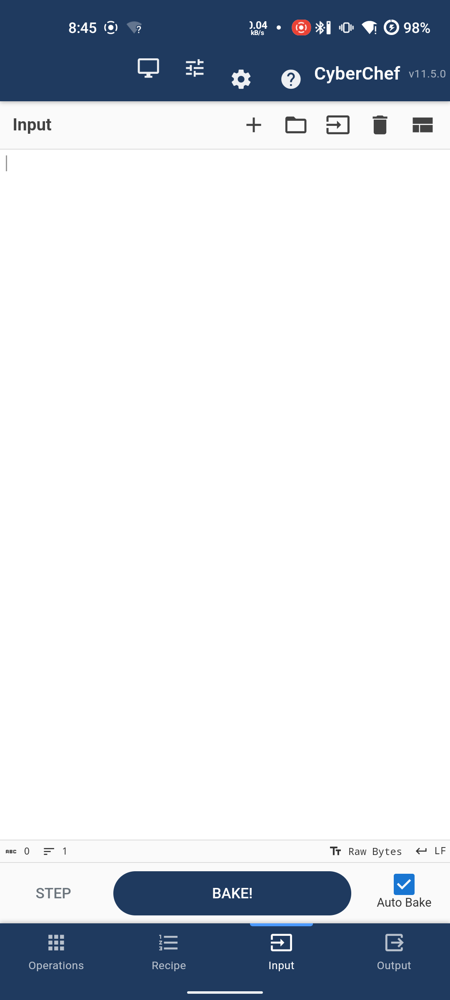

| 区域 | 作用 |
| --- | --- |
| **① 顶栏** | 左边是标题，右边四个图标：`🖥` 切桌面布局、`⚙` 工作区设置、`⚙️` 选项、`❓` 帮助 |
| **② 工作区** | 当前面板，一屏只显示一个（或分屏时两个） |
| **③ 操作栏** | 常驻的 `STEP`（单步）、`BAKE!`（烘焙）、`Auto Bake`（自动烘焙） |
| **④ 底部切页** | Operations（选算法）/ Recipe（配方）/ Input（输入）/ Output（输出） |

Recipe 页签上会出现数字角标，就是当前配方里有几步。

> 顶栏和底部切页会自动避开状态栏和手势条，不会被挡住。

---

## 二、基本流程：输入 → 选算法 → 看结果

### 1. 输入数据

切到 **Input**，直接点空白处打字。也可以用标题栏的按钮：

| 图标 | 作用 |
| --- | --- |
| `＋` | 新建一个输入页签（可以同时处理多份数据） |
| `📂` | 打开整个文件夹，每个文件一个页签 |
| `⏏` | 打开单个文件 |
| `🗑` | 清空输入和输出 |

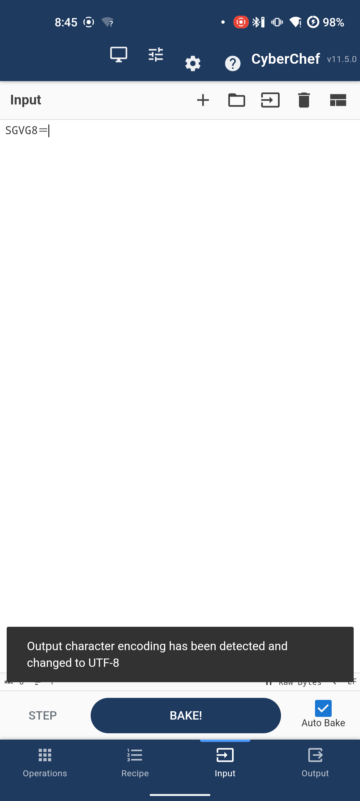

> 手机会**自动识别编码**。上面截图里输入 Base64 后，下方提示 "Output character encoding has been detected and changed to UTF-8"。

### 2. 选算法（重点）

**505 个算法不用翻列表，直接搜**。切到 **Operations**，点搜索框输入关键词：

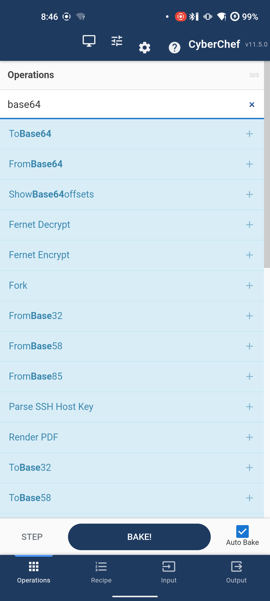

注意每行右边都有一个 `＋`。**手指点一下整行，算法就加进配方了**——不需要拖拽，也不需要双击。

搜索是模糊匹配的：搜 `base64` 除了 To/From Base64，还会带出 Fernet、Fork、From Base32/58/85 这些相关的。

最上面还有 **Favourites（收藏夹）**，常用的算法可以先收进去（桌面版拖进去，或者用收藏夹编辑按钮）。

### 3. 调整配方

切到 **Recipe**，你会看到每一步都有明确的手势按钮：

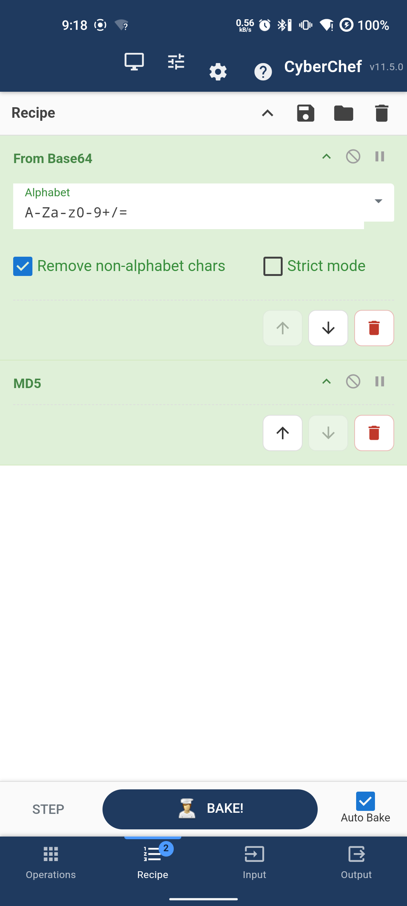

| 按钮 | 作用 |
| --- | --- |
| **↑ / ↓** | 上移 / 下移这一步（到顶/到底会自动变灰） |
| **🗑** | 删除这一步 |
| **参数区** | 直接改，和桌面版一样（下拉框、输入框、勾选框） |
| **`⌃` / `?` / `‖`** | 折叠 / 说明 / 临时禁用这一步 |

> 桌面版靠拖拽排序，手指上不好用，所以这里换成了明确的按钮。

### 4. 看结果

切到 **Output**：

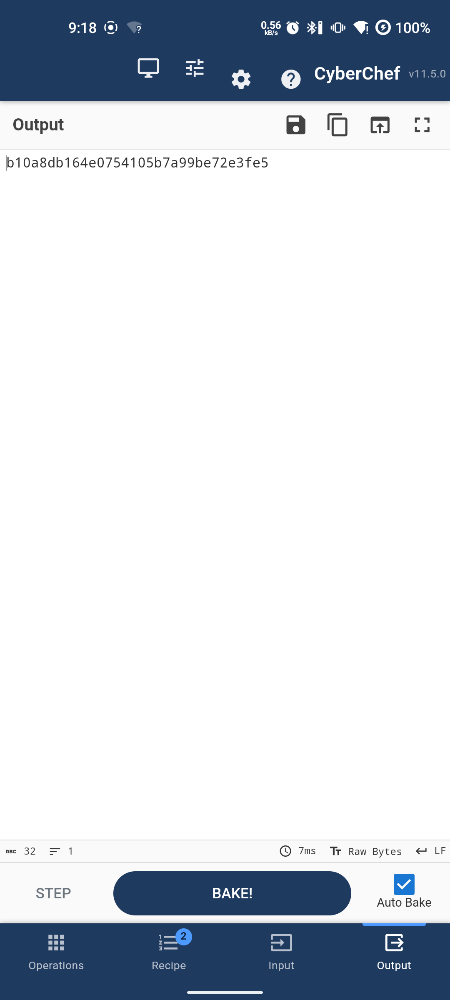

底部状态栏会显示烘焙耗时（上图 `12ms`）、字符数、行数。标题栏的按钮：

| 图标 | 作用 |
| --- | --- |
| `💾` | 保存到文件（存到下载目录，大文件会分块写） |
| `📋` | 复制全部输出 |
| `🔄` | 把输出内容替换回输入 |
| `⛶` | 最大化输出面板 |

**Auto Bake 默认是开的**，改动输入或配方会自动重新烘焙。处理大数据时建议关掉它，改完再手动点 `BAKE!`。

### 保存输出到文件

点输出面板的 `💾`，会弹出原生对话框让你确认文件名：

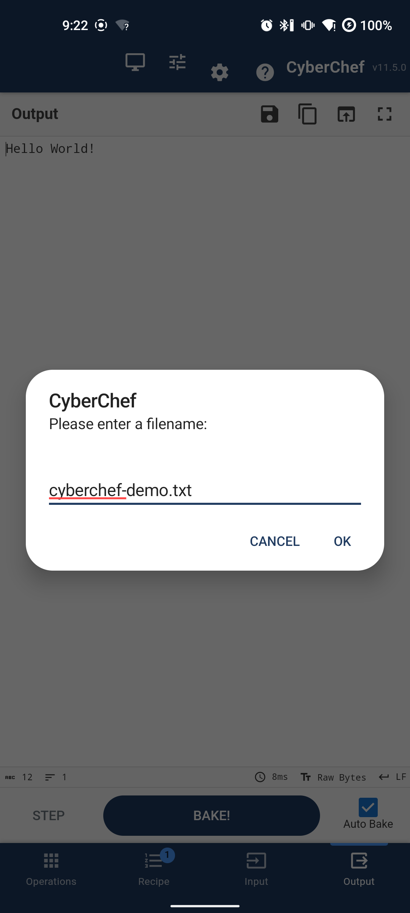

确认后文件会存到手机的 **`下载/CyberChef/`** 目录里（Android 10 以上不需要任何存储权限）。文件较大时是分块流式写入的，不会一次占满内存。

---

## 三、两个进阶技巧

### 单步执行：看清每一步的中间结果

配方一长，出错时很难判断是哪一步的问题。**关掉 Auto Bake，然后连点 `STEP`**，CyberChef 会一次只跑一个算法。

以 `From Base64 → MD5` 为例：

**第 1 次点 STEP** —— 只跑了 From Base64：

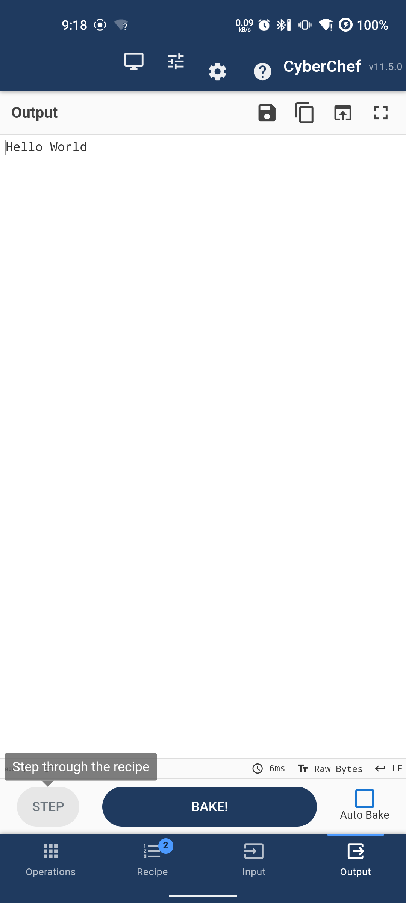

**第 2 次点 STEP** —— 才跑 MD5：

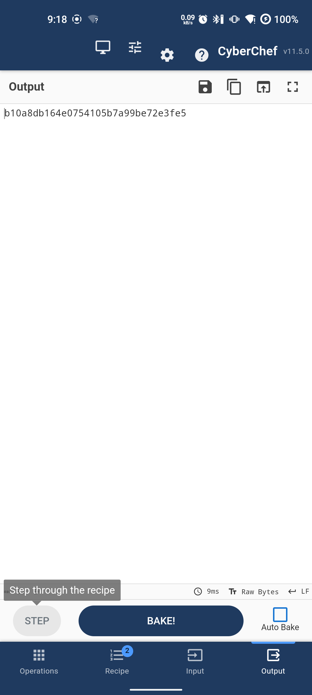

这样每一步的输入输出都能单独看到，比一次跑到尾好排查得多。

> `Auto Bake` 关掉后，改动配方或输入不会立刻重算，输出面板会标记为「过期」。

### Magic：不用知道是什么编码，让它自己猜

这是 CyberChef 最好用的功能，手机上也一样。假设你拿到一串来路不明的数据 `48656c6c6f20576f726c6421`：

1. 加进 **Input**
2. 搜索并添加 **Magic** 这个算法

输出会变成一张识别表：

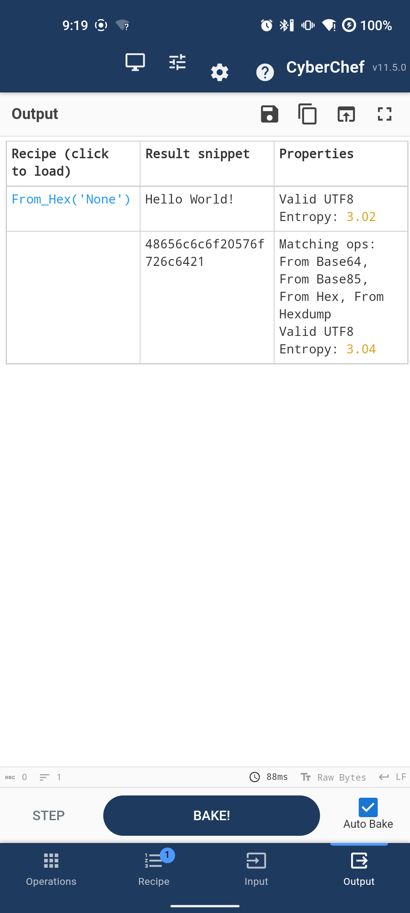

| 列 | 含义 |
| --- | --- |
| **Recipe (click to load)** | 它建议的算法，**点一下就把配方换成这个** |
| **Result snippet** | 用该算法解出来的结果预览 |
| **Properties** | 数据特征：是否合法 UTF-8、熵值等 |

上图它认出这是十六进制，点一下 `From_Hex('None')`，配方就自动变成了 `From Hex`，输出直接得到 `Hello World!`。

下面的 `Matching ops` 还列了其它可能（From Base64、From Base85、From Hexdump…），可以逐个试。

---

## 四、分屏工作区（手机版特有）

单面板模式下，选算法和看配方要来回切页签。**分屏**让两块同时显示。

点顶栏第二个图标 `⚙`（工作区设置）：

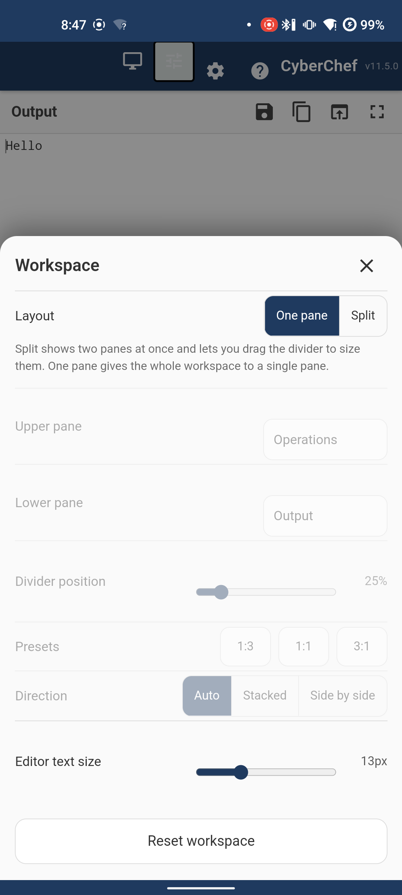

面板里可以调：

- **Layout**：`One pane`（单面板）/ `Split`（分屏）
- **Upper pane / Lower pane**：上/下两块各显示什么
- **Divider position**：分隔条位置（也可以直接拖）
- **Presets**：`1:3` / `1:1` / `3:1` 三个快捷比例
- **Direction**：`Auto`（竖屏上下、横屏左右自动切换）/ `Stacked`（强制上下）/ `Side by side`（强制左右）
- **Editor text size**：输入/输出编辑器的字号
- **Reset workspace**：一键还原

切到 Split 后：

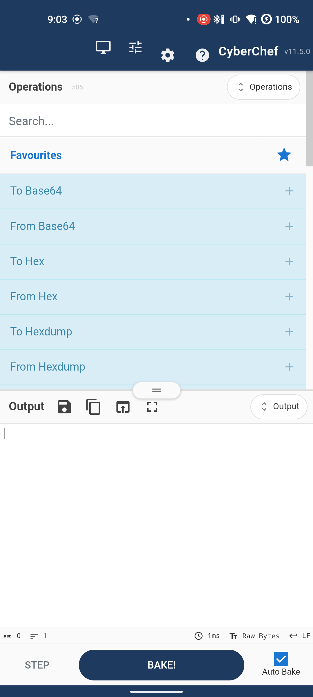

**中间那条带 `≡` 的横条就是分隔条，直接拖它就能改两块的大小**——这就是"调整选算法工作区尺寸"。截图里我把上面拖大了：

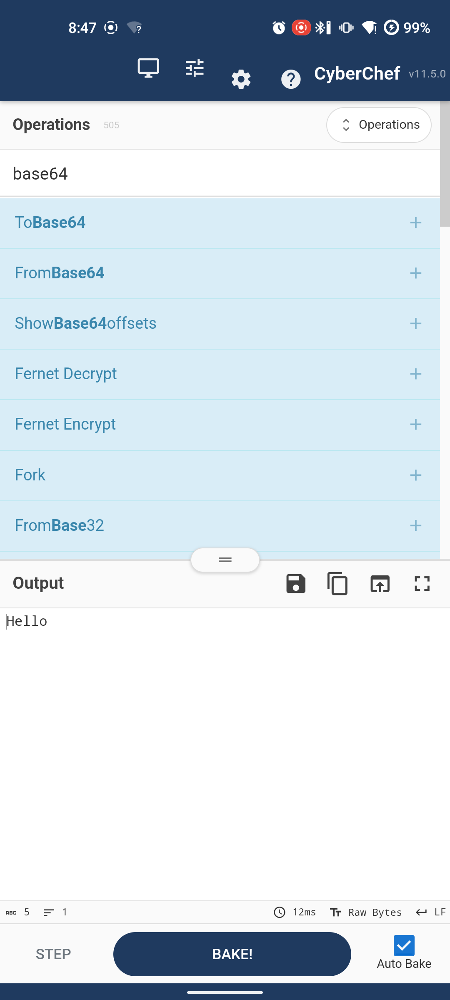

几个细节：

- 分隔条**点一下**会在 `25% / 50% / 75%` 之间循环，懒得拖的时候用
- 每个面板标题栏右边有个 **`⇅ 面板名`** 的芯片，点它可以把这块换成别的面板
- 分屏时底部切页栏会收起来，把空间让给内容
- **所有设置都会记住**，下次打开还是这样

---

## 五、手机上值得知道的几个点

### 键盘弹出时工作区自动让位

点输入框时键盘弹出来，工作区会缩到键盘上方，不会挡住：

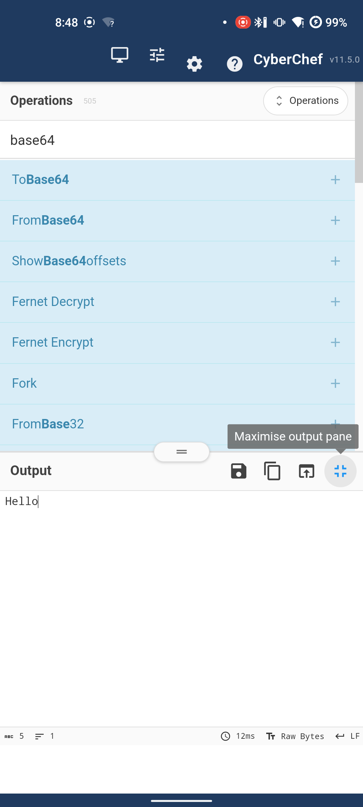

### 返回键有层次

按返回键不会直接退出，而是按这个顺序退：

1. 关掉打开的弹窗 / 工作区设置面板
2. 关掉算法选择菜单
3. 清空算法搜索框
4. 回到上一个看过的页签
5. 都没有了才退出 App

### 别的 App 可以分享文件过来

在文件管理器或聊天软件里选"分享"→ CyberChef，文件会直接作为输入打开。也可以用"打开方式"选 CyberChef。

### 用桌面布局

顶栏第一个图标 `🖥` 可以切回桌面版四栏布局（平板或横屏大屏时有用）。同样的按钮切回移动版。

### 数据不出手机

除 `HTTP request`、`DNS over HTTPS`、`Show on map` 这三个算法会主动联网外，其余全部在本地 WebView 里跑，不联网也能用。

---

## 六、一个完整例子

以你手机上刚跑过的为例：

1. **Input** 输入 `SGVsbG8=`
2. **Operations** 搜 `base64`，点一下 `From Base64`
3. **Output** 立刻显示 `Hello`（Auto Bake 自动触发的）

多步配方就是重复第 2 步。比如常见的：

```
From Base64  →  Gunzip  →  From Hex
```

一步一步加进去，每加一步 Output 都会实时更新，哪一步出错一眼就能看到。
